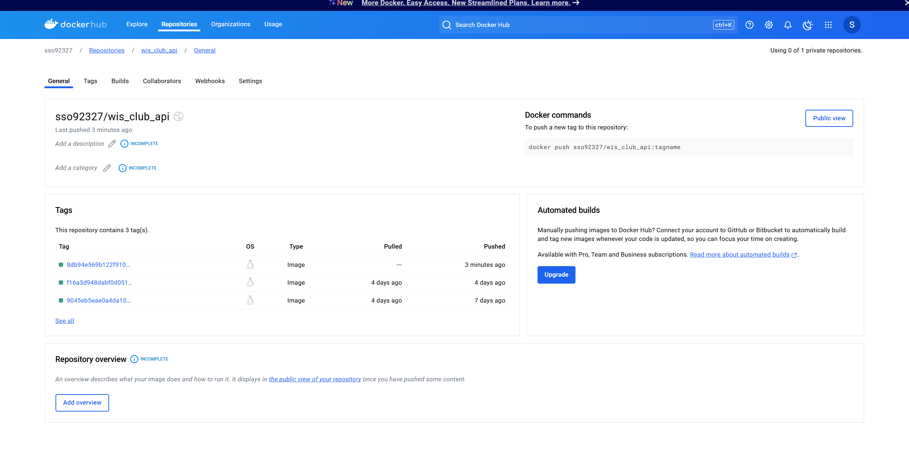

# IS218 Final Project
#### Sharon Oh | Fall 2024 | IS218001

#### [DockerHub Link](https://hub.docker.com/repository/docker/sso92327/wis_club_api/general) 

I took IS218 during my Fall 2024 semester at NJIT. This course was quite a challenging and difficult course for me. It was probably the hardest course I’ve had all semester. As someone who does not have much prior experience coding or using various databases or programs like Docker, Linux, etc, I was in an unfamiliar situation and often felt discouraged, stressed, and burnt out. It was hard being in this course because of the challenges with time management and just staying resilient throughout the different projects we had to do. Through trial and error and testing out different solutions, I was able to get everything to work out at the end. I felt like giving up a lot of the time, but with the assistance of the professor, online resources, my own self-learning, and constantly asking questions, I was able to learn a lot throughout this course and increase my knowledge in programming. Coding has never been a strong suit of mine and I only have about a year’s worth of coding knowledge with pretty a basic foundation in Python, HTML and CSS. Utilizing a bunch of other things like pandas, Docker, APIs, and more throughout the course was a lot harder to grasp and balance. Yet, my knowledge from the beginning of this course till now has grown tremendously and I now know how to deal with user management systems, fix issues and bugs to ensure quality in the code, use environment variables, logging, test cases, GitHub Actions, and more. While the journey was very difficult, I can say that my knowledge and understanding with programming has developed. Furthermore, my experience working on this final project was quite difficult. This final project deals with creating new features for a user management system and implementing different test cases to test that feature. Using different things like Docker, APIs, PGAdmin, and the openapi spec doc was hard to figure out. I think that the previous homework assignment has helped a lot though. It prepared me well for this final and made me feel less overwhelmed, so that way I could focus on creating new API endpoints for my feature and developing test cases. Having that prior experience was definitely helpful for this project. The hardest thing about working on this project was staying motivated even when I kept getting errors or bugs. I would solve one bug and test it and then it would create another issue. I would fix that issue which would then create another issue. Oftentimes, it felt like I was not making any progress, but by staying resilient and patient, I was able to get everything to work out. I think it was also difficult because I should've started earlier than I did. Time management is always important, but especially for this project, I realized the importance of it because I could’ve asked more questions if I had started earlier. This would’ve helped me deal with a lot of the confusion early on. Thankfully, emailing the professor and doing my own learning helped me get more clarity. Additionally, throughout the course of the project, I took notes on the side to make sure I was updated with the status of my project and its requirements. By also making detailed commits, I stayed organized with my work. 

For the final project, the feature that I decided to implement in this system was a user search and filtering system so that users can be searched based on specific criteria such as their email, nickname, role, or by date range. These API endpoints are specific to the admin and managers, so they are able to see the various users in the database that fit the criteria. For this, I created 2 new endpoints. The first endpoint was dealing with search functionality that allowed users to be obtained by their email, nickname, or role. This endpoint includes 3 different field/search parameters, 2 where you can type and 1 where you can dropdown a menu to select a role. Users can be searched by a singular search parameter or by multiple parameters. However, if searched with multiple parameters, only users that fit all of the criteria will be displayed. If none of the inputs match any of the users, there will be a display message saying that there is no user. The second endpoint was to filter users based on registration date (this option seemed more feasible than the other option of account status, which is why I choose to implement this aspect). With this feature, you can insert a start date and end date in the format of YEAR-MONTH-DAY to search for users created within a certain time frame. It checks for a valid input and a logical time before it begins searching for the users. This feature utilizes the database information to see the “created_at” timestamp and then displays the users within the provided time range. I created 10 test cases for different scenarios regarding these endpoints. The test cases are as follows: (1) Searching by user’s nickname, (2) Searching by user’s email, (3) Searching by user’s role, (4) Searching by user’s email and nickname, (5) Searching by user’s email and role, (6) Searching by user’s nickname and role, (7) Filtering by date successfully, (8) Filtering by incorrect start date, (9) Filtering by incorrect end date, (10) Filtering by start date after end date. These test cases cover different edge cases and scenarios to cover various situations. I went from 93 test cases to 103 test cases and ran pytest to make sure that everything worked as planned. To go into a bit more detail, I created the new API endpoints in the user_routes.py file, similar to the format of the already existing endpoints, to ensure consistency. I utilized already existing functions in the UserService and implemented them into this new endpoint. I chose to do POST for the HTTP method because it was already used, so I knew it would work well and also because POST is good for retrieving data that have complex queries involving numerous parameters. I believed it was better for more complex filtering, so I decided to implement that. Additionally, I made sure the responses from these endpoints were in a consistent format with the other endpoints, and that the output followed pagination patterns that were also seen in this file. Regarding the test cases, I had initially created them in the test_user_service.py file and had it structured to test the backend logic and functions of the program. I realized later on that while these tests passed, they weren’t directly testing the API endpoint, which was more important to make sure that it works. After this realization, I moved my test cases to the test_users_api.py file where I tested the features directly using the API endpoints. For the majority of these tests, I created a new user using the already existing endpoint that creates new users, asserted the user, and then searched or filtered for that user to retrieve the right information. By creating the users and querying them in the database, I am testing the full functionality of the program. This ensures that all of the components work as expected, simulating real-world usage by validating both the user creation and retrieval of the user based on different parameters. Another example of where I had to pivot was when I was getting errors from the pytest stating that there was an issue with Mailtrap. I was having too many emails sent out during the test runs, since it utilized the create user endpoint and actually sent out emails. I solved this issue by using mock tests and patches to prevent emails from being sent out externally. This allowed me to still test the APIs but get rid of the emails being sent out automatically. 

Overall, while this project was quite challenging and had me solve various problems in different ways, I think it was a good way to apply all my knowledge and skills from this course. Being able to complete this project was very satisfying and I am proud that I was able to practice more programming and increase my knowledge, despite all the difficulties, throughout this course. 

